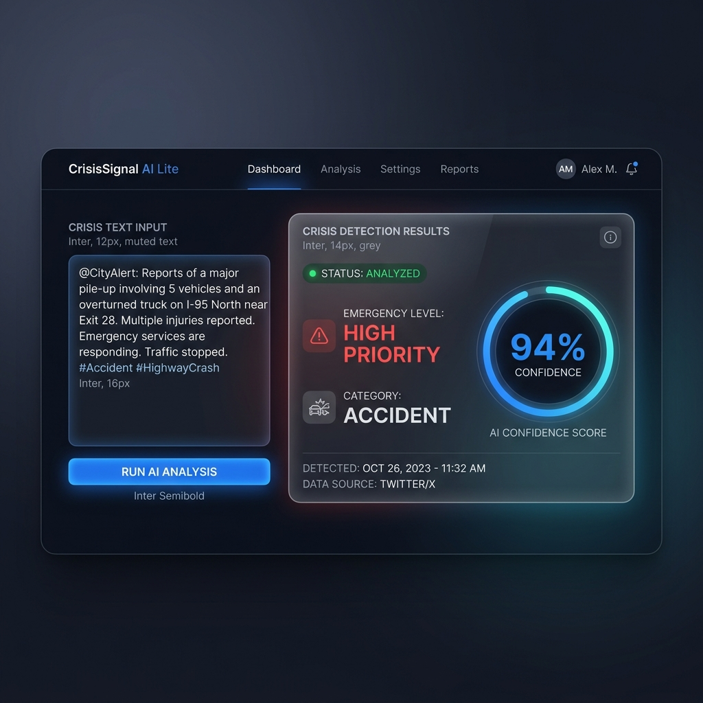
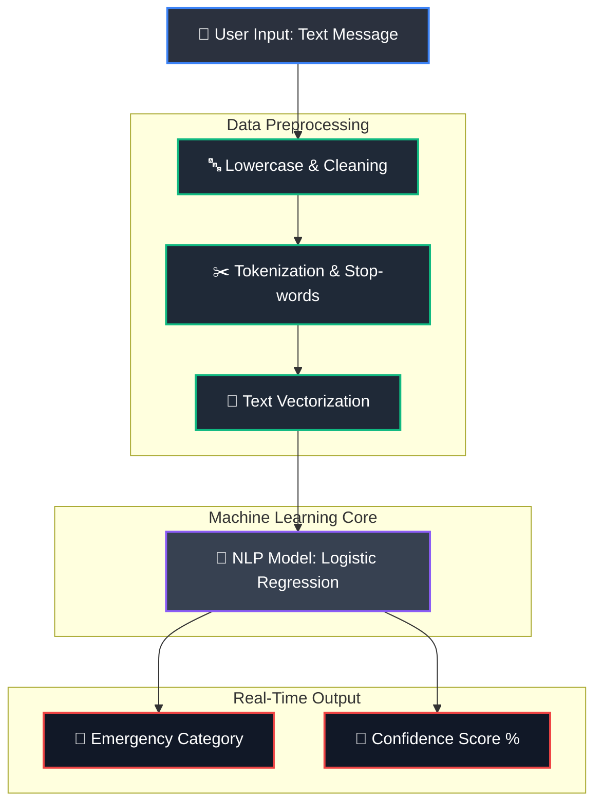

# System Architecture & UI Design

This document visually represents the design and workflow of **CrisisSignal AI Lite**.

## 🎨 UI Mockup / Wireframe
The following is the initial UI concept for the Streamlit dashboard. It features a modern, dark-themed alert system that presents the classified category and confidence score directly to the user.

## 🗺️ Machine Learning Workflow

The system takes user text input, cleans it using NLP techniques, passes it through a classification model, and outputs the result in real-time.

